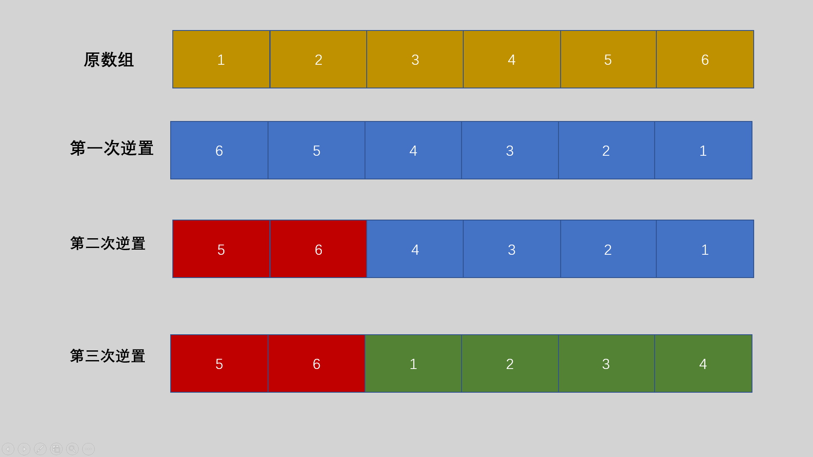

# PAT笔记

## 类型转换

### 整型和字符型

```cpp
char ch[100];
int n;

// 整形转字符型
sprintf(ch, "%d", n);
// 字符型转整型
sscanf(ch, "%d", &n);
```

### 字符数组和字符串

```cpp
// 字符数组转成字符串
char ch[] = "QIUYEYIJIAN";		// 定义字符数组
string str(ch);					// 将字符数组转成字符串
string str = ch;				// 另一种方式

// 字符串转字符数组
char buff = str.c_str();
```

## 排序

C++ 中sort函数和C中的qsort函数是用于排序的函数，推荐使用sort函数，简单与效率并存。

sort函数的使用必须加上头文件`#include<algorithm>`和`using namespace std;` 如果不加比较函数，默认从小到大排序。

```cpp
sort(首元素地址（必填），尾元素地址的下一个地址（必填），比较函数（非必填）);
```

```cpp
// 不使用比较函数
int arr[5] = {3, 1, 2, 4};
sort(arr, arr + 4);		
```

```cpp
// 使用比较函数
struct Student {
    string name;
    int score;
} stu[100];

/*
1. 如果两个学生分数不相同，那么分数高的排在前面
2. 如果分数相同， 将姓名字典序小的排在前面
*/
bool cmp(Student a, Student b) {
    if(a.score != b.score) {
        return a.score > b.score;
    } else {
        return a.name > b.name;
    }
}

sort(stu, stu + 100, cmp);
```


## 素数（质数）判断

素数又称质数，是指除了1和本身之外，不能被其他数整除的一类数，反之称为合数。1既不是素数，也不是合数。

```cpp
bool isPrime(int n) {		// 时间复杂度O(sqrt(n))
  if (n <= 1) return false;
  int sqr = (int)sqrt(n * 1.0);
  for (int i = 2; i <= sqr; i++) {
    if (n % i == 0) return false;
  }
  return true;
}
```


## 数组元素循环右移问题及解决方法

通过对数组的多次逆置来达到循环的效果，一共对数组进行了三次逆置，所以就需要构造一个函数，这个函数既可以逆置一个数组，也可以逆置数组的部分区间。

需要注意移动的位数M可能大于数组的长度N，需要首先令M = M % N;

1. 先将整个数组[0，N)逆置一遍；
2. 将数组的前部分区间[0，M)进行逆置；
3. 将数组的后部分区间[M，N)进行逆置；

假设N=6，M=2。具体数组为nums[6]={1,2,3,4,5,6}; 则逆置过程如下图所示：



参考文章：https://www.jb51.net/article/181740.htm


