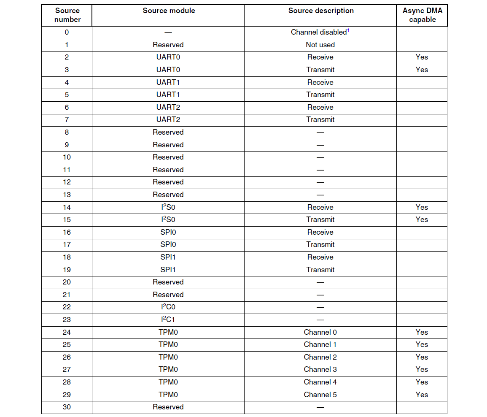
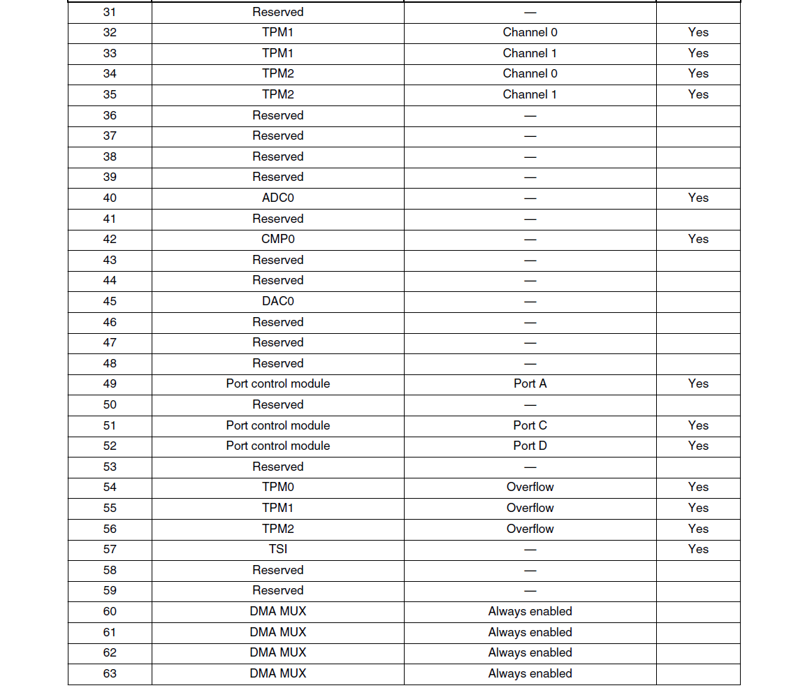

# 第八次学习札记

## KL36 DMA

KL36包含一个DMA多路请求复用器（DMAMUX0），拥有4个可独立编程的DMA通道，每个通道支持多达63个请求信号。有些模块的请求支持异步DMA请求操作，下面表格中都有注明。

KL系列的DMA控制器具有一个32位的数据缓存，拥有4个独立可编程的DMA通道，每个通道支持多达63个DMA请求信号，具

## UART DMA

主要流程

打开空闲中断，响应空闲中断，开启DMA接收

字节数计数器使用之前一定要先清零

重新设置DMA下次要接收的数据字节数，注意，数据传输数量范围为0至65535。这个寄存器只能在通道不工作(DMA_CCRx的EN=0)时写入。通道开启后该寄存器变为只读，指示剩余的待传输字节数目。寄存器内容在每次DMA传输后递减。数据传输结束后，寄存器的内容或者变为0;或者当该通道配置为自动重加载模式时，寄存器的内容将被自动重新加载为之前配置时的数值。当寄存器的内容为0时，无论通道是否开启，都不会发生任何数据传输。

DMA三个中断：传输完成中断，传输一半中断，传输错误中断

发送通道使能之后就立即将源地址数据通过串口发送过去，而接收通道使能之后，只有数据请求时才会生效。换句话说，发送通道使能，为当前DMA发送服务。接收通道使能，为下次DMA接收服务。

UART1或2被占用了，只能使用UART0

https://wenku.baidu.com/view/b6ad1e8258fb770bf68a558c.html